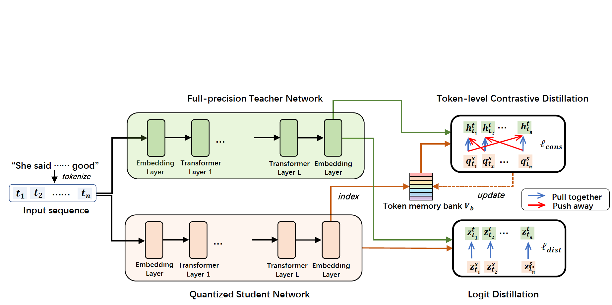
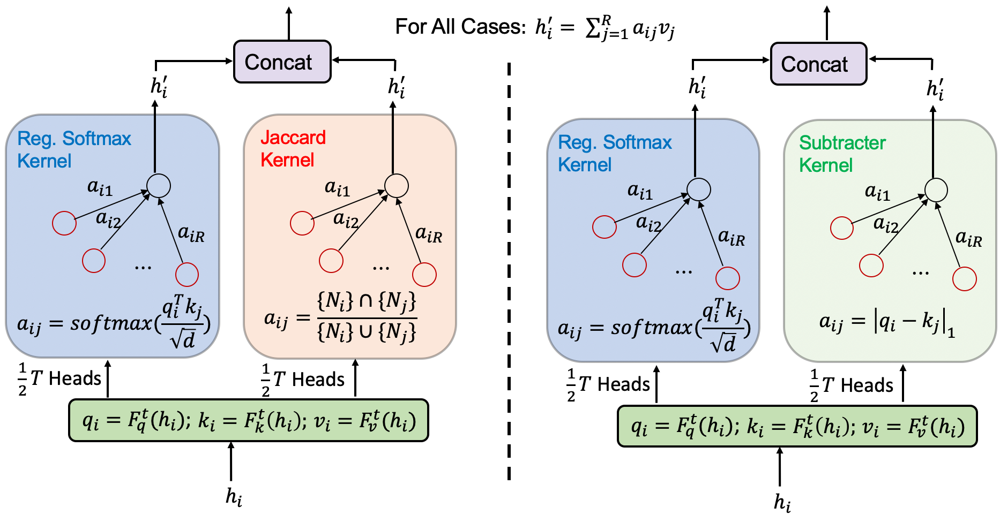
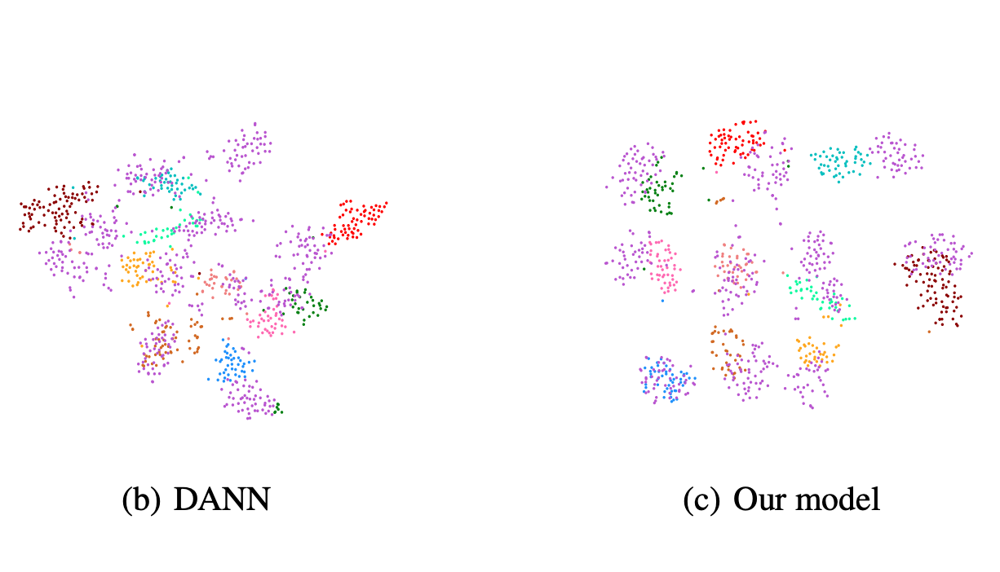

<!--  -->


# Short Biography
I am Chaofan Tao (陶超凡), a PhD candidate in The Univerisity of Hong Kong (HKU), supervised by [Prof. Ngai Wong](https://www.eee.hku.hk/~nwong/) and [Prof. Ping Luo](http://luoping.me/). My research papers are published in ACL/EMNLP/ECCV/T-NNLS/CIKM, .etc. 

My research interests are: <br>
1. ```Network Compression & Acceleration:```  Pruning, quantization, distillation .etc to reduce model size and speedup inference. <br>
2. ```Pre-trained Language Models:```  Multi-task pre-trained (generative) models, which scales from 100M to 10B models <br>
3. ```Multi-modal Learning:``` Video & Text multi-task learning <br>

Email: tcftrees AT gmail DOT com  <br>

**I am looking for machine learning-related internship in 2023, please directly email me if u are interested !**
<!-- &nbsp;&nbsp;&nbsp;&nbsp; -->
<!--  -->
<!-- [Univerisity of Hong Kong (HKU)](https://www.hku.hk/), supervised by [Prof. Ngai Wong](https://www.eee.hku.hk/~nwong/) and [Prof. Ping Luo](http://luoping.me/). 
I received my B.S. in the [Yingcai Honors College](http://www.yingcai.uestc.edu.cn/),  -->

 
<br>

# Services
* Reviewer of: <br>
```Conference:```  ICCV-2021, CVPR-2022, ICML-2022, ECCV-2022, NeurIPS-2022, EMNLP-2022, CVPR-2023 <br>
```Journal:``` T-NNLS
<br>


# Publications
[Google Scholar](https://scholar.google.com/citations?hl=en&view_op=list_works&gmla=AJsN-F5DfisY6qynQkPPreVmBlpCYV8WALf-n4aVHphvfHF9GAmm2cYErmRxuXccCwkrSglgJN4L6s2t4Cn5Ei6r5jEfLOvnoA&user=gjmfLroAAAAJ)


<!-- <div style="display:inline-block; border:2px; margin:10px;">
 
<p>Binxiao Huang, <b>Chaofan Tao</b>, Rui Lin, Ngai Wong. What Do Adversarially trained Neural Networks Focus: A Fourier Domain-based Study, Preprint
<a href="https://arxiv.org/abs/2203.08739">[PDF]</a>,
<a href="">[Code will be available]</a>,
<br>
<i>TL,DR: We understand model robustness from a Fourier domain-based study.</i>
</p>
</div> -->


<div style="display:inline-block; border:2px; margin:10px;">
 
<p>Dongsheng Chen, <b>Chaofan Tao</b>, Lu Hou, Lifeng Shang, Xin Jiang, Qun Liu. LiteVL: Efficient Video-Language Learning with Enhanced Spatial-Temporal Modeling, EMNLP-2022
<a href="https://arxiv.org/abs/2210.11929">[PDF]</a>,
<i><b>TL,DR</b>: We achieve SOTA video-language performance on  text-video retrieval/videoQA, without any video-language pre-training, based on a simple-yet-effective adaptation from a pre-trained image-language model.</i>
</p>
</div>

<div style="display:inline-block; border:2px; margin:10px;">
 
<p><b>Chaofan Tao</b>, Lu Hou, Wei Zhang, Lifeng Shang, Xin Jiang, Qun Liu, Ping Luo, Ngai Wong. Compression of Generative Pre-trained Language Models via Quantization, ACL-2022 <font style="color:#dddd00">(outstanding paper)</font>
<a href="https://arxiv.org/abs/2203.10705">[PDF]</a>,
<a href="https://mp.weixin.qq.com/s/H0ydIEAef-wh-341RZtzng">[Blog(中文解读)]</a>
<i><b>TL,DR</b>: We firstly explore compressing generative PLMs (i.e. GPT-2, BART) by quantizing the parameters from full-precision to lower bits, and apply to language modeling /summarization /dialogue tasks.</i>
</p>
</div>


<div style="display:inline-block; border:2px; margin:10px;">
 
<p>Cong Chen, <b>Chaofan Tao</b> and Wong, Ngai. LiteGT: Efficient and Lightweight Graph Transformers, CIKM-2021
<a href="https://dl.acm.org/doi/pdf/10.1145/3459637.3482272">[PDF]</a>,
<a href="https://github.com/ChaofanTao/litegt">[Code]</a>,
<a href="https://underline.io/lecture/36309-litegt-efficient-and-lightweight-graph-transformers">[Video]</a>,
<i><b>TL,DR</b>: LiteGT is an efficient learner on arbitrary graphs, which saves computation, memory and model size altogether.</i>
</p>
</div>

<div style="display:inline-block; border:2px; margin:10px;">
 
<p><b>Chaofan Tao</b>, Lin, Rui and Chen, Quan and Zhang, Zhaoyang and Luo, Ping and Wong, Ngai. FAT: Frequency-Aware Transformation for Bridging Full-Precision and Low-Precision Deep Representations, T-NNLS
<a href="https://ieeexplore.ieee.org/document/9837828">[PDF]</a>,
<a href="https://github.com/ChaofanTao/FAT_Quantization">[Code]</a>
<i><b>TL,DR</b>: FAT is a quantization method that models the task of quantization via a representation transform and a standard quantizer.</i>
</p>
</div>

<div style="display:inline-block; border:2px; margin:10px;">
 
<p><b>Chaofan Tao</b>, Qinhong Jiang, Lixin Duan, and Ping Luo. Dynamic and Static Context-aware LSTM for Multi-agent Motion Prediction, ECCV-2020,
<a href="http://www.ecva.net/papers/eccv_2020/papers_ECCV/html/3801_ECCV_2020_paper.php">[PDF]</a>,
<a href="../files/ECCV20-SM.pdf">[Supplementary material]</a>,
<a href="../files/ECCV20-demo.mp4">[Demo]</a>,
<a href="../files/bib/dscmp_eccv20.txt">[Cite]</a>
<i><b>TL,DR</b>: DSCMP is a multi-modal trajectory predictor that considers  spatio-temporal interactions among agents and scene layout.</i>
</p>
</div>

<div style="display:inline-block; border:2px; margin:10px;">
 
<p><b>Chaofan Tao</b>, Fengmao Lv, Lixin Duan and Min Wu. "Minimax Entropy Network: Learning Categorical-Invariant Features for Domain Adaptation".
<a href="https://arxiv.org/abs/1904.09601">[PDF]</a>,
<a href="../files/bib/mmen.txt">[Cite]</a>
<i><b>TL,DR</b>:  This work utilizes fine-grained category-level information for domain adaptation.</i>
</p>
</div>

<div style="display:inline-block; border:2px; margin:10px;">
 
<p>Yi Bin, Yang Yang, <b>Chaofan Tao</b>, Zi Huang, Jingjing Li and Heng Tao Shen. "MR-NET: Exploiting Mutual Relation for Visual  Relationship Detection", AAAI-2019. 
<a href="https://www.aaai.org/ojs/index.php/AAAI/article/view/4819">[PDF]</a>,
<a href="../files/bib/mrnet_aaai19.txt">[Cite]</a>
<i><b>TL,DR</b>: MR-Net detects the visual relationships in images by exploring the mutual relation between paired objects. </i>
</p>
</div>


<!-- # Services
  Teaching Assistant on ENGG1330 Computer programming I 
<br>  -->

<!-- 

# Skills
Programming: C++/C, Python  <br>
Languages: Chinese (native); English (fluent), IELTS: 7.5, GRE: 321+3   <br>

<br>

<!-- # Hobbies
- Basketball [Dunk when in youth]()
- Photographing
- Hiking -->


===================  
Last Updated: Oct. 28, 2022. 

<br>
<br>
<br>
