[[Google Scholar]](https://scholar.google.com/citations?hl=en&view_op=list_works&gmla=AJsN-F5DfisY6qynQkPPreVmBlpCYV8WALf-n4aVHphvfHF9GAmm2cYErmRxuXccCwkrSglgJN4L6s2t4Cn5Ei6r5jEfLOvnoA&user=gjmfLroAAAAJ)

 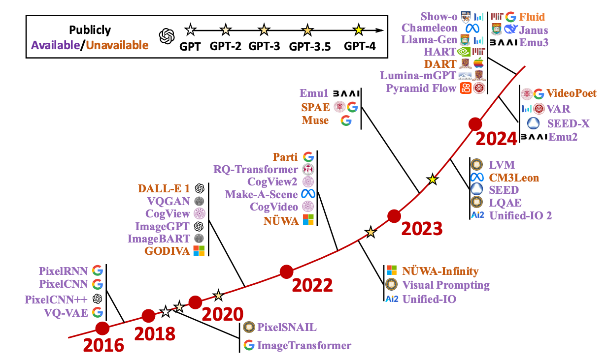
Jing Xiong, Gongye Liu, Lun Huang, Chengyue Wu, Taiqiang Wu, Yao Mu, Yuan Yao, Hui Shen, Zhongwei Wan, Jinfa Huang, <b>Chaofan Tao $\ddagger$</b>, Shen Yan, Huaxiu Yao, Lingpeng Kong, Hongxia Yang, Mi Zhang, Guillermo Sapiro, Jiebo Luo, Ping Luo, Ngai Wong
<a href="https://arxiv.org/pdf/2411.05902v1">[PDF]</a>,
<a href="https://github.com/ChaofanTao/Autoregressive-Models-in-Vision-Survey">[Code]</a>,

<i><b>TL,DR</b>: We provide a comprehensive and timely literature review of visual autoregressive models. We divide the fundamental frameworks based on the representation strategy of the visual sequence. Then we explore the applications in computer vision, including image generation, video generation, 3D generation,  multi-modality, and the emerging domains such as embodied AI and 3D medical AI.</i>

 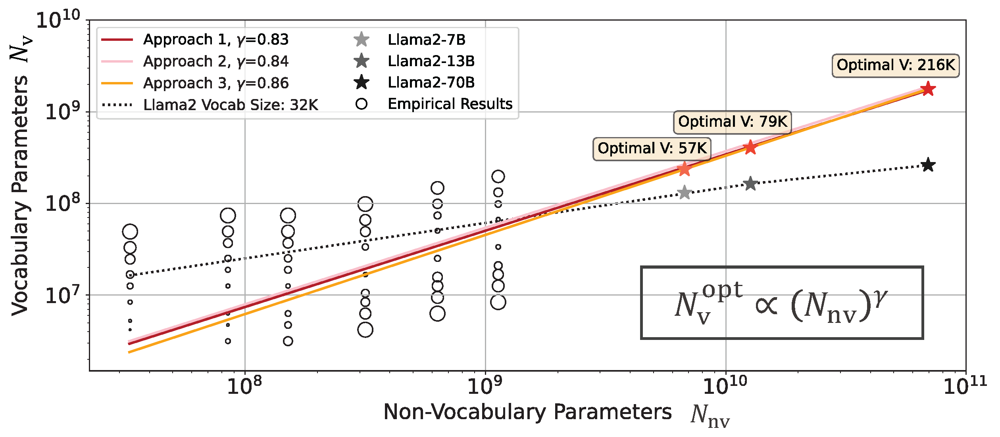

<b>Chaofan Tao</b>, Qian Liu, Longxu Dou, Niklas Muennighoff, Zhongwei Wan, Ping Luo, Min Lin, Ngai Wong. Scaling Laws with Vocabulary: Larger Models Deserve Larger Vocabularies, <b>NeurIPS-2024</b> 
<a href="https://arxiv.org/abs/2407.13623">[PDF]</a>,
<a href="https://github.com/sail-sg/scaling-with-vocab">[Code]</a>,
<a href="https://huggingface.co/spaces/sail/scaling-with-vocab-demo">[Demo]</a>,
<a href="../files/scaling-vocab_v2.pdf">[Slide]</a>,

<i><b>TL,DR</b>: This paper investigates models with different vocabularies, substantiating a scaling law that optimizes computational resources with the consideration of vocabulary and other attributes jointly.</i>

 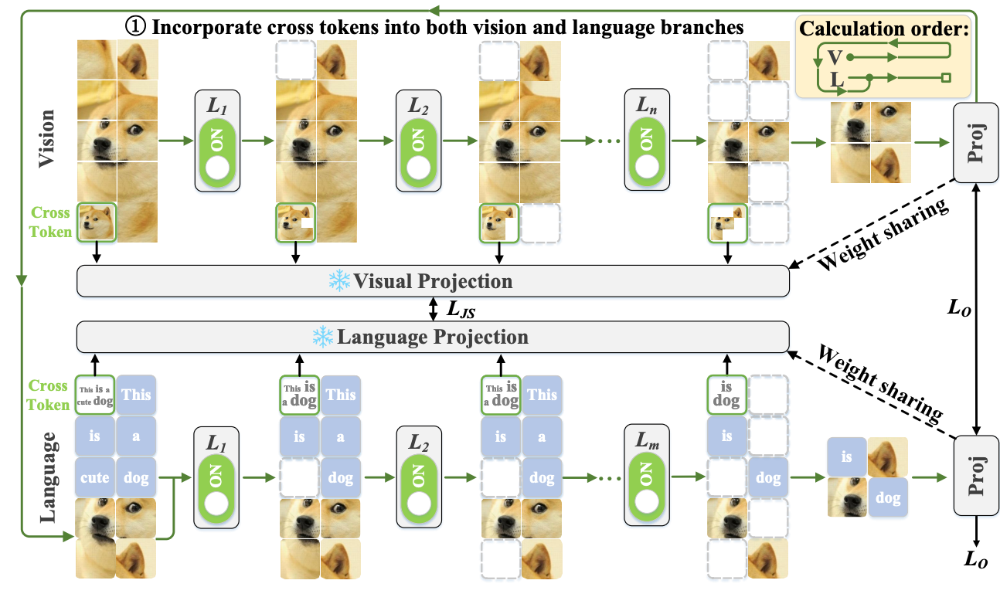

Dachuan Shi, <b>Chaofan Tao</b>, Anyi Rao, Zhendong Yang, Chun Yuan, Jiaqi Wang. CrossGET: Cross-Guided Ensemble of Tokens for Accelerating Vision-Language Transformers, <b>ICML-2024</b>
<a href="https://arxiv.org/abs/2305.17455">[PDF]</a>,
<a href="https://github.com/sdc17/CrossGET">[Code]</a>,
<i><b>TL,DR</b>: CrossGET is a general acceleration framework for vision-language Transformers. This framework adaptively combines tokens in real-time during inference, significantly reducing computational costs.</i>

 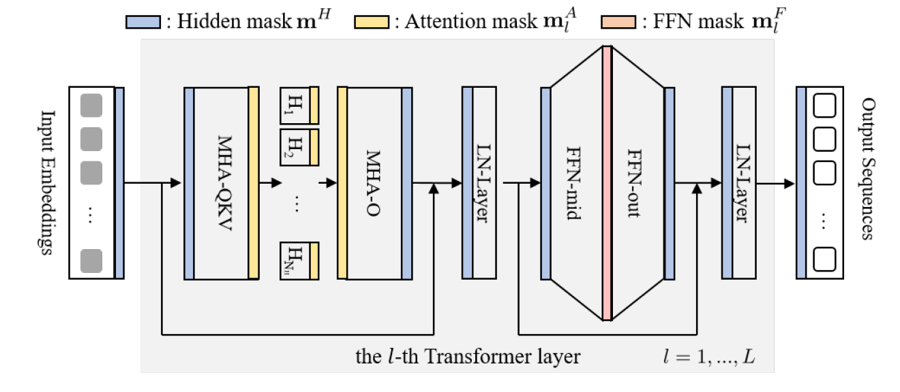

<b>Chaofan Tao</b>, Lu Hou, Haoli Bai, Jiansheng Wei, Xin Jiang, Qun Liu, Ping Luo, Ngai Wong. Structured Pruning for Efficient Generative Pre-trained Language Models, Findings of <b>ACL-2023</b>
<a href="https://aclanthology.org/2023.findings-acl.692/">[PDF]</a>,
<i><b>TL,DR</b>: We propose a multi-dimensional structured pruning framework, SIMPLE, for generative PLMs (i.e. GPT-2, BART), which can also be easily extended to block pruning and unstructured pruning.</i>

 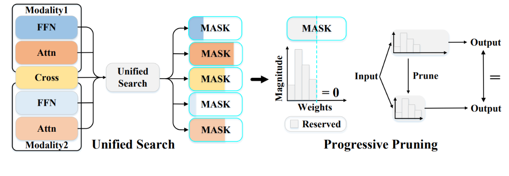

Dachuan Shi, <b>Chaofan Tao</b>, Ying Jin, Zhendong Yang, Chun Yuan, Jiaqi Wang. Upop: Unified and Progressive Pruning for Compressing Vision-Language Transformers, <b>ICML-2023</b>
<a href="https://arxiv.org/pdf/2301.13741.pdf">[PDF]</a>,
<a href="https://github.com/sdc17/UPop">[Code]</a>,
<a href="https://dachuanshi.com/UPop-Project/">[Project]</a>,
<i><b>TL,DR</b>: UPop is the first structured pruning framework for vision-language Transformers. It enables effective structured pruning on various multi-modal & uni-modal tasks, datasets, and model architectures.</i>

 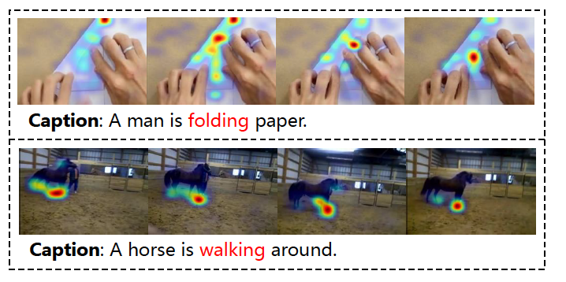

Dongsheng Chen, <b>Chaofan Tao</b>, Lu Hou, Lifeng Shang, Xin Jiang, Qun Liu. LiteVL: Efficient Video-Language Learning with Enhanced Spatial-Temporal Modeling, <b>EMNLP-2022</b>
<a href="https://arxiv.org/abs/2210.11929">[PDF]</a>,
<i><b>TL,DR</b>: We achieve SOTA video-language performance on  text-video retrieval/videoQA, without any video-language pre-training, based on a simple-yet-effective adaptation from a pre-trained image-language model.</i>

 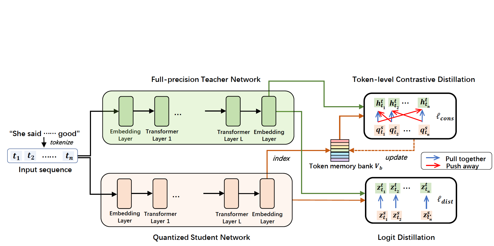

<b>Chaofan Tao</b>, Lu Hou, Wei Zhang, Lifeng Shang, Xin Jiang, Qun Liu, Ping Luo, Ngai Wong. Compression of Generative Pre-trained Language Models via Quantization, <b>ACL-2022</b> 
(outstanding paper award)
<a href="https://arxiv.org/abs/2203.10705">[PDF]</a>,
<a href="https://mp.weixin.qq.com/s/H0ydIEAef-wh-341RZtzng">[Blog(中文解读)]</a>
<i><b>TL,DR</b>: We firstly explore compressing generative PLMs (i.e. GPT-2, BART) by quantizing the parameters from full-precision to lower bits, and apply to language modeling/summarization/dialogue tasks.</i>

 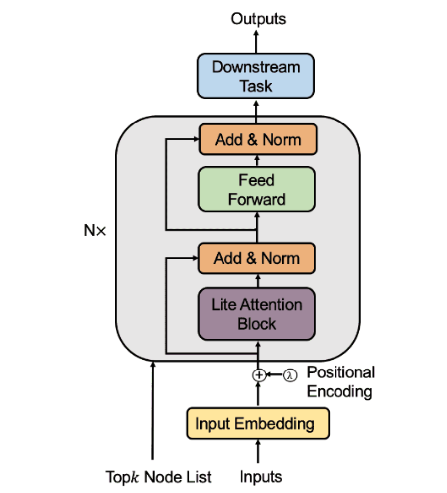

Cong Chen, <b>Chaofan Tao</b> and Ngai Wong. LiteGT: Efficient and Lightweight Graph Transformers, <b>CIKM-2021</b>
<a href="https://dl.acm.org/doi/pdf/10.1145/3459637.3482272">[PDF]</a>,
<a href="https://github.com/ChaofanTao/litegt">[Code]</a>,
<a href="https://underline.io/lecture/36309-litegt-efficient-and-lightweight-graph-transformers">[Video]</a>,
<i><b>TL,DR</b>: LiteGT is an efficient learner on arbitrary graphs, which saves computation, memory and model size altogether.</i>

 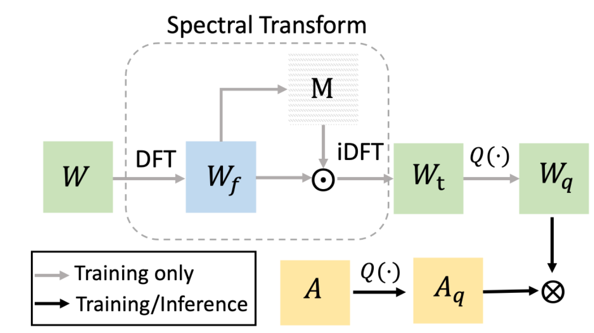

<b>Chaofan Tao</b>, Lin, Rui and Chen, Quan and Zhang, Zhaoyang and Luo, Ping and Wong, Ngai. FAT: Frequency-Aware Transformation for Bridging Full-Precision and Low-Precision Deep Representations, <b>IEEE T-NNLS</b>
<a href="https://ieeexplore.ieee.org/document/9837828">[PDF]</a>,
<a href="https://github.com/ChaofanTao/FAT_Quantization">[Code]</a>
<i><b>TL,DR</b>: FAT is a quantization method that models the task of quantization via a representation transform and a standard quantizer.</i>

 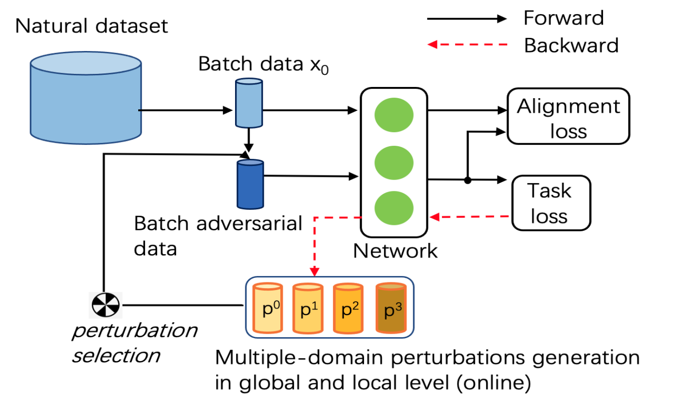
<b>Chaofan Tao</b>, Ngai Wong", ODG-Q: Robust Quantization via Online Domain Generalization, <b>ICPR-2022</b>
<a href="https://arxiv.org/abs/2210.08701">[PDF]</a>,
<i><b>TL,DR</b>: We propose an efficient way to improve the robustness of quantized models on the large-scale datasets. </i>

 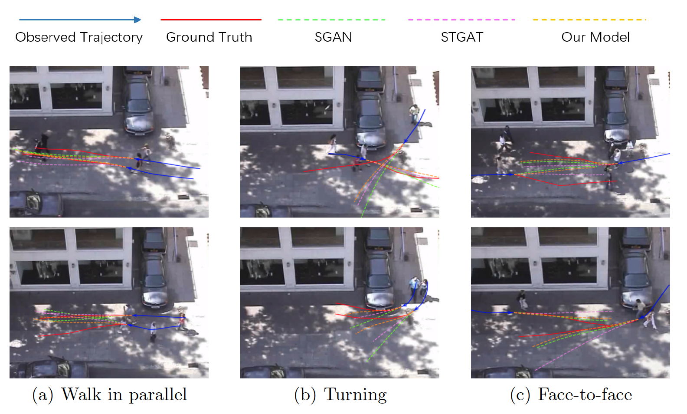

<b>Chaofan Tao</b>, Qinhong Jiang, Lixin Duan, and Ping Luo. Dynamic and Static Context-aware LSTM for Multi-agent Motion Prediction, <b>ECCV-2020</b>
<a href="http://www.ecva.net/papers/eccv_2020/papers_ECCV/html/3801_ECCV_2020_paper.php">[PDF]</a>,
<a href="../files/ECCV20-SM.pdf">[Supplementary material]</a>,
<a href="../files/ECCV20-demo.mp4">[Demo]</a>,
<a href="../files/bib/dscmp_eccv20.txt">[Cite]</a>
<i><b>TL,DR</b>: DSCMP is a multi-modal trajectory predictor that considers  spatio-temporal interactions among agents and scene layout.</i>

 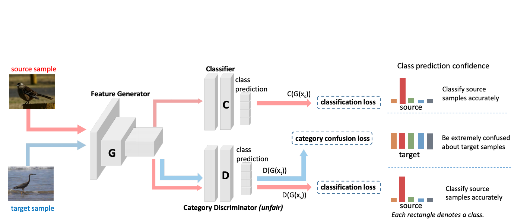

<b>Chaofan Tao</b>, Fengmao Lv, Lixin Duan and Min Wu. "Minimax Entropy Network: Learning Categorical-Invariant Features for Domain Adaptation".
<a href="https://arxiv.org/abs/1904.09601">[PDF]</a>,
<a href="../files/bib/mmen.txt">[Cite]</a>
<i><b>TL,DR</b>:  This work utilizes fine-grained category-level information for domain adaptation.</i>

