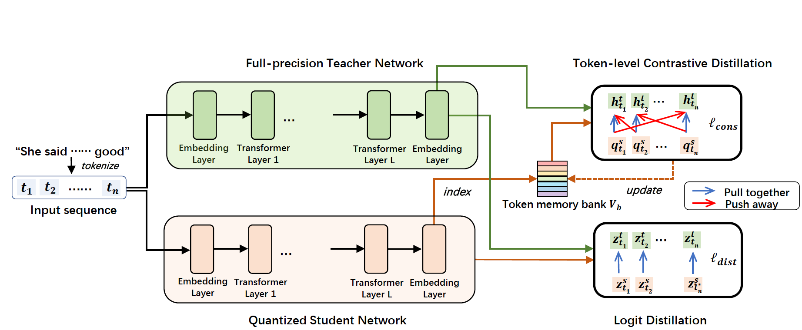
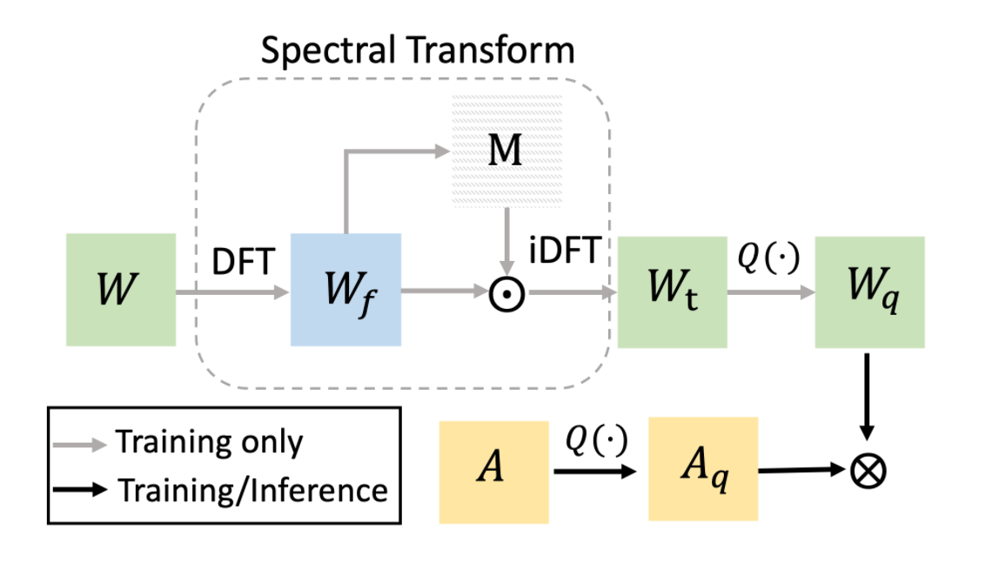
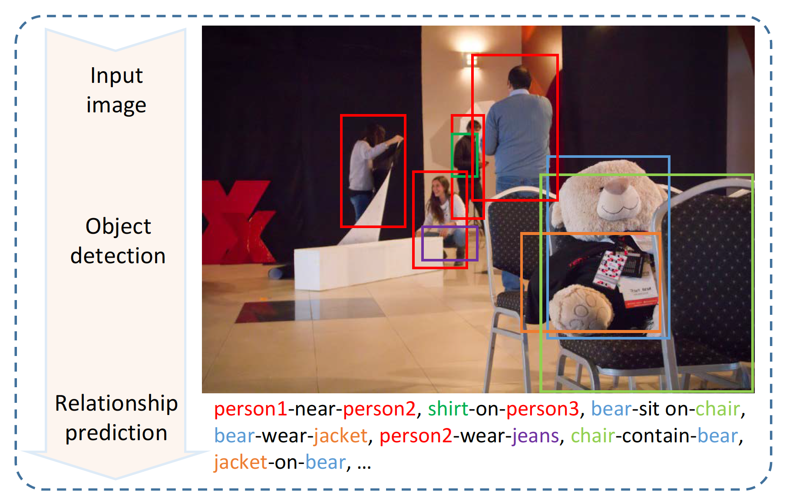

[Google Scholar](https://scholar.google.com/citations?hl=en&view_op=list_works&gmla=AJsN-F5DfisY6qynQkPPreVmBlpCYV8WALf-n4aVHphvfHF9GAmm2cYErmRxuXccCwkrSglgJN4L6s2t4Cn5Ei6r5jEfLOvnoA&user=gjmfLroAAAAJ)

 

Binxiao Huang, <b>Chaofan Tao</b>, Rui Lin, Ngai Wong. What Do Adversarially trained Neural Networks Focus: A Fourier Domain-based Study, Preprint
<a href="https://arxiv.org/abs/2203.08739">[PDF]</a>,
<a href="">[Code will be available]</a>,
 
<i>TL,DR: We understand model robustness from a Fourier domain-based study.</i>

 

<b>Chaofan Tao</b>, Lu Hou, Wei Zhang, Lifeng Shang, Xin Jiang, Qun Liu, Ping Luo, Ngai Wong. Compression of Generative Pre-trained Language Models via Quantization, ACL-2022
<a href="https://arxiv.org/abs/2203.10705">[PDF]</a>,
<a href="">[Code will be available]</a>,
<a href="https://mp.weixin.qq.com/s/H0ydIEAef-wh-341RZtzng">[Blog(中文解读)]</a>,
 
<i>TL,DR: We firstly explore compressing generative PLMs (i.e. GPT, BART) by quantizing the parameters from full-precision to lower bits.</i>

 

Cong Chen, <b>Chaofan Tao</b> and Wong, Ngai. LiteGT: Efficient and Lightweight Graph Transformers, CIKM-2021
<a href="https://dl.acm.org/doi/pdf/10.1145/3459637.3482272">[PDF]</a>,
<a href="https://github.com/ChaofanTao/litegt">[Code]</a>,
<a href="https://underline.io/lecture/36309-litegt-efficient-and-lightweight-graph-transformers">[Video]</a>,
 

<i>TL,DR: LiteGT is an efficient learner on arbitrary graphs, which saves computation, memory and model size altogether.</i>

 

<b>Chaofan Tao</b>, Lin, Rui and Chen, Quan and Zhang, Zhaoyang and Luo, Ping and Wong, Ngai. FAT: Learning Low-Bitwidth Parametric Representation via Frequency-Aware Transformation, Preprint
<a href="https://arxiv.org/abs/2102.07444">[PDF]</a>,
<a href="https://github.com/ChaofanTao/FAT_Quantization">[Code]</a>,
 

<i>TL,DR: FAT is a quantization method that models the task of quantization via a representation transform and a standard quantizer.</i>

 

<b>Chaofan Tao</b>, Qinhong Jiang, Lixin Duan, and Ping Luo. Dynamic and Static Context-aware LSTM for Multi-agent Motion Prediction, ECCV-2020,
<a href="http://www.ecva.net/papers/eccv_2020/papers_ECCV/html/3801_ECCV_2020_paper.php">[PDF]</a>,
<a href="../files/ECCV20-SM.pdf">[Supplementary material]</a>,
<a href="../files/ECCV20-demo.mp4">[Demo]</a>,
<a href="../files/bib/dscmp_eccv20.txt">[Cite]</a>
 

<i>TL,DR: DSCMP is a trajectory predictor that considers  spatio-temporal interactions among agents and scene layout.</i>

 

<b>Chaofan Tao</b>, Fengmao Lv, Lixin Duan and Min Wu. "Minimax Entropy Network: Learning Categorical-Invariant Features for Domain Adaptation".
<a href="https://arxiv.org/abs/1904.09601">[PDF]</a>,
<a href="../files/bib/mmen.txt">[Cite]</a>
 

<i>TL,DR:  This work utilizes fine-grained category-level information for domain adaptation.</i>

 

Yi Bin, Yang Yang, <b>Chaofan Tao</b>, Zi Huang, Jingjing Li and Heng Tao Shen. "MR-NET: Exploiting Mutual Relation for Visual  Relationship Detection", AAAI-2019. 
<a href="https://www.aaai.org/ojs/index.php/AAAI/article/view/4819">[PDF]</a>,
<a href="../files/bib/mrnet_aaai19.txt">[Cite]</a>
 

<i>TL,DR: MR-Net detects the visual relationships in images by exploring the mutual relation between paired objects. </i>

